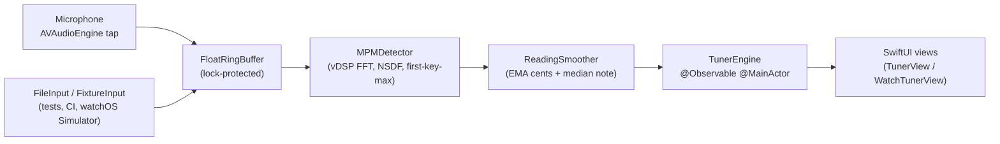

# MB-Tuner

A modern, from-scratch chromatic tuner for **iOS / iPadOS / macOS / watchOS** built on AVAudioEngine + Accelerate/vDSP with the **McLeod Pitch Method** (MPM). Zero third-party GPL code, zero tracking, on-device only.

- **Deployment floors:** iOS 17, iPadOS 17, macOS 14, watchOS 10
- **DSP core:** pure Swift + Accelerate (vDSP FFT + Wiener-Khinchin autocorrelation → NSDF → first-key-maximum @ k=0.93 → parabolic interpolation)
- **Latency:** ~1 ms per detect measured on Apple silicon (desktop); total end-to-end ~30-50 ms at a 4096-sample window / 1024-sample hop
- **Accuracy:** ±1 ¢ on clean sine waves, ±5 ¢ on summed-harmonic guitar signals (including the low-E case that raw autocorrelation/HPS fail)

## Repository layout

```
MB-tuner/
├── TunerKit/                    Local Swift Package (shared core)
│   ├── Package.swift
│   ├── Sources/
│   │   ├── TunerCore/           Pure Swift + Accelerate (MPM, note math, smoothing, ring buffer)
│   │   ├── TunerAudio/          AVAudioEngine wrapper, permissions, @Observable TunerEngine
│   │   └── TunerUI/             Shared SwiftUI components (NeedleMeter, NoteLabel, CentsBar, TunerView)
│   └── Tests/
│       ├── TunerCoreTests/      DSP correctness (incl. harmonic guitar low-E parity test)
│       └── TunerAudioTests/     End-to-end pipeline + latency budget
└── Apps/
    ├── iOS/                     iOS/iPadOS SwiftUI app (universal)
    ├── macOS/                   Native macOS SwiftUI app (not Catalyst)
    └── watchOS/                 Standalone watchOS SwiftUI app + WidgetKit complication
```

## Architecture



The `AudioInput` protocol abstracts the source so tests, CI, and the watchOS Simulator can replay the same pipeline from fixture WAV/synthetic arrays without touching a real microphone.

## Running the shared tests

```bash
cd TunerKit
swift test
```

Expected output: 20 tests pass, MPM latency printed at end (~1–3 ms on Apple silicon). The key correctness tests are:

- `testHarmonicGuitarLowE` — rejects the 2nd-harmonic-biased E3 answer that raw autocorrelation gives.
- `testStandardGuitarStrings` — full E2…E4 range at ±5 ¢ tolerance.
- `testNoiseDoesNotProduceConfidentPitch` — gate white noise out.
- `testEngineConvergesOnA4` / `testLowEPipelineParity` — end-to-end pipeline smoke tests via `FixtureInput`.
- `testDetectorThroughput` — enforces per-detect latency budget.

## Xcode setup (one-time, per platform)

Each `Apps/<platform>` folder contains source, `Info.plist`, entitlements and a `PrivacyInfo.xcprivacy` privacy manifest. Wire them up as three separate targets in a single `.xcworkspace` that also embeds the local `TunerKit` package:

1. **Create the workspace.** In Xcode: *File → New → Workspace* (`MB-tuner.xcworkspace`) at repo root.
2. **Add the Swift package.** Drag `TunerKit/Package.swift` into the workspace.
3. **Create three app targets**, each referencing the files in its `Apps/<platform>` folder:

| Target        | Template                              | Minimum OS   | Products from `TunerKit` |
| ------------- | ------------------------------------- | ------------ | ------------------------ |
| iOS (universal) | iOS App, SwiftUI, Swift              | iOS 17.0     | `TunerCore`, `TunerAudio`, `TunerUI` |
| macOS         | macOS App, SwiftUI, Swift (NOT Catalyst) | macOS 14.0 | `TunerCore`, `TunerAudio`, `TunerUI` |
| watchOS       | watchOS App, SwiftUI, Watch-Only      | watchOS 10.0 | `TunerCore`, `TunerAudio`, `TunerUI` |

4. For each target, in *Build Phases → Copy Bundle Resources*, add its `PrivacyInfo.xcprivacy`. Point *Signing & Capabilities → Code Signing Entitlements* at the target's `.entitlements` file.
5. On the **macOS target** enable *Hardened Runtime* and *App Sandbox* in Signing & Capabilities. The required `com.apple.security.device.audio-input` entitlement is already in `Apps/macOS/GuitarTuner.entitlements`. Missing it causes `engine.start()` to silently succeed with zero-level buffers.
6. On the **watchOS target** add the WidgetKit extension target pointing at `Apps/watchOS/Complication/TunerComplication.swift`.

## Per-platform build plans

### iOS / iPadOS (`Apps/iOS`)

- `.record` + `.measurement` + `.mixWithOthers` session (disables AGC, high-pass, noise suppression, echo cancellation).
- Reads `inputNode.outputFormat(forBus: 0)` after the session is active and taps with the exact hardware format — no forced mono conversion at the tap boundary.
- `isIdleTimerDisabled = true` while tuning; `scenePhase` drives start/stop.
- Handles `AVAudioSession.interruptionNotification`, `routeChangeNotification`, `mediaServicesWereResetNotification`, and `.AVAudioEngineConfigurationChange` with a suspend-flag pattern (see `MicInput.swift`).
- No `UIBackgroundModes = audio` — avoids 2.5.4 review friction.

### macOS (`Apps/macOS`)

- Native AppKit SwiftUI app (**not Catalyst** — Catalyst collapses `availableInputs` to a single aggregate port, crippling USB interface selection).
- `WindowGroup` + `.windowResizability(.contentSize)` + `Settings { … }` scene for preferences.
- Required capabilities: Hardened Runtime, App Sandbox, `com.apple.security.device.audio-input`, `NSMicrophoneUsageDescription`.
- Run `Apps/macOS/scripts/verify-entitlements.sh <built .app>` before distribution to catch the silent-buffer failure mode.

### watchOS (`Apps/watchOS`)

- Standalone watch-only (`WKRunsIndependentlyOfCompanionApp = true`).
- Real-time mic tap via the same `MicInput` path — **but** watch-specific policies:
  - Engine stops whenever `scenePhase != .active` (wrist-down, background).
  - Auto-stop after 45 s of continuous silence to protect battery.
  - AOD disabled (`WKSupportsAlwaysOnDisplay = false`) — the orange mic indicator would stay on wrist-down, and continuous DSP into AOD wrecks battery.
  - No `WKExtendedRuntimeSession` (Apple rejects mindfulness/workout abuse for tuners).
- Digital Crown drives A4 calibration with `.focusable()` applied *before* `.digitalCrownRotation`.
- WidgetKit complication (`accessoryInline`, `accessoryCircular`, `accessoryRectangular`) as launch affordance.
- Permission is **independent** of the iPhone — prompt in-context on first Start, and on denial instruct the user to use the iPhone Watch app (no programmatic Settings deep-link on watchOS).

## Privacy & compliance

- `PrivacyInfo.xcprivacy` per platform declares `NSPrivacyAccessedAPICategoryUserDefaults` with reason `CA92.1` (A4 reference, last-used tuning). Add `SystemBootTime` / `35F9.1` only if you actually call `ProcessInfo.systemUptime` or `kern.boottime`.
- `NSPrivacyTracking = false`, no collected data types — on-device audio is not "collected" per Apple's App Privacy Details guidance; answer "No, we do not collect data" on the ASC questionnaire.
- `NSMicrophoneUsageDescription` follows Apple's formula (what, why, concrete example, scope reassurance). Rejection-safe wording ships in all three Info.plists.
- `ITSAppUsesNonExemptEncryption = false` (standard HTTPS only).
- No Paid Apps Agreement required — this is a free no-IAP app. Only the top-level Developer Program License Agreement must be current.

## Testing strategy

- **Unit** (`TunerCoreTests`): pure-math MPM on synthetic sines and harmonic guitar signals; cents arithmetic; smoothing filters.
- **Integration** (`TunerAudioTests`): swap the mic for a `FixtureInput` to drive the full `TunerEngine` through MPM + smoother + `@Observable` publishing in real time.
- **Performance**: `testDetectorThroughput` enforces <20 ms per detect; budget is 46 ms at 2048-sample hop.
- **UI regression** (recommended add-on): [point-free SnapshotTesting](https://github.com/pointfreeco/swift-snapshot-testing) against the iOS/macOS targets.
- **XCUITest**: `addUIInterruptionMonitor` registered *before* `launch()`, followed by `app.tap()` to activate the monitor when the mic prompt appears.

## License notes

All in-repo code is MIT-licensable. No GPL dependencies are used. YIN (de Cheveigné & Kawahara, JASA 2002) and MPM (McLeod & Wyvill, ICMC 2005) were implemented from the published papers; none of TarsosDSP's or aubio's source code was consulted. Algorithms and mathematical formulas are not copyrightable; specific source expression is.
